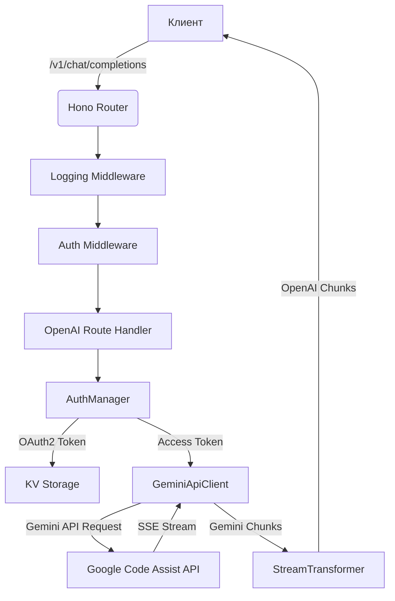

# Руководство по проекту

**Версия:** 1.1
**Статус:** Завершено

## 1. Введение

Этот документ содержит описание архитектуры, технологий, стандартов кодирования и других ключевых аспектов проекта **Gemini CLI OpenAI Worker**. Он предназначен для разработчиков, чтобы обеспечить единое понимание и согласованный подход к разработке. Проект представляет собой Cloudflare Worker, который предоставляет OpenAI-совместимый API для моделей Google Gemini, используя OAuth2 аутентификацию.

## 2. Обзор архитектуры

Проект построен на базе Cloudflare Workers с использованием веб-фреймворка **Hono**. Архитектура является модульной и разделена на несколько ключевых компонентов:

*   **`index.ts`**: Точка входа приложения. Здесь инициализируется Hono, настраиваются middleware (CORS, логирование, аутентификация) и подключаются основные маршруты.
*   **`routes/`**: Директория содержит обработчики HTTP-маршрутов.
    *   **`openai.ts`**: Реализует OpenAI-совместимые эндпоинты (`/v1/models`, `/v1/chat/completions`).
    *   **`debug.ts`**: Предоставляет эндпоинты для отладки (`/v1/debug/cache`, `/v1/token-test`).
*   **`middlewares/`**: Промежуточное ПО для обработки запросов.
    *   **`auth.ts`**: Проверяет API-ключ (`Authorization: Bearer ...`), если он задан в `OPENAI_API_KEY`.
    *   **`logging.ts`**: Логирует входящие запросы и исходящие ответы.
*   **`auth.ts`**: `AuthManager` - ключевой класс, отвечающий за OAuth2 аутентификацию. Он управляет получением, кешированием (в Cloudflare KV) и обновлением токенов доступа.
*   **`gemini-client.ts`**: `GeminiApiClient` - класс для взаимодействия с Google Code Assist API (который используется для доступа к Gemini). Он формирует запросы, обрабатывает стриминг ответов (SSE) и парсит их.
*   **`stream-transformer.ts`**: `TransformStream`, который конвертирует поток данных от Gemini API в OpenAI-совместимый формат чат-комплишенов.
*   **`helpers/`**: Вспомогательные модули для инкапсуляции сложной логики (авто-переключение моделей, обработка цитат, валидация конфигурации).
*   **`config.ts` & `constants.ts`**: Файлы с константами и конфигурационными значениями.
*   **`models.ts`**: Определяет поддерживаемые модели Gemini и их характеристики.
*   **`types.ts`**: Содержит все основные TypeScript-интерфейсы и типы, используемые в проекте.

### Диаграмма взаимодействия



## 3. Технологический стек

*   **Среда выполнения**: [Cloudflare Workers](https://workers.cloudflare.com/)
*   **Веб-фреймворк**: [Hono](https://hono.dev/) - легковесный и быстрый фреймворк для Edge-сред.
*   **Язык**: [TypeScript](https://www.typescriptlang.org/)
*   **Зависимости**:
    *   `hono`: Основной фреймворк.
    *   `@cloudflare/workers-types`: Типы для Cloudflare Workers API.
*   **Инструменты разработки**:
    *   `wrangler`: CLI для разработки и развертывания Cloudflare Workers.
    *   `typescript`: Компилятор TypeScript.
    *   `eslint`: Линтер для статического анализа кода.
    *   `prettier`: Форматер кода для поддержания единого стиля.
    *   `docker` & `docker-compose`: Для контейнеризации и локального запуска.

## 4. Работа с Git

Хотя в проекте нет строгого `CONTRIBUTING.md`, рекомендуется придерживаться следующих практик:

1.  **Ветки**: Создавать новые ветки для каждой фичи или исправления (`feature/my-new-feature`, `fix/bug-name`).
2.  **Коммиты**: Писать осмысленные сообщения к коммитам.
3.  **Pull Requests**: Все изменения вносить через Pull Requests в основную ветку.
4.  **.gitignore**: Файл `.gitignore` настроен для игнорирования `node_modules`, логов, переменных окружения (`.env`, `.dev.vars`), артефактов сборки и специфичных для IDE файлов (`.vs`).

## 5. Конфигурация и запуск

### 5.1. Конфигурация

1.  **`wrangler.toml`**: Основной конфигурационный файл для Cloudflare Worker. Здесь указывается имя воркера, точка входа (`src/index.ts`), дата совместимости и привязка к KV-хранилищу.
2.  **`.dev.vars`**: Файл для локальной разработки. Содержит секреты, такие как `GCP_SERVICE_ACCOUNT` (JSON с OAuth2 кредами) и `OPENAI_API_KEY`. **Этот файл не должен попадать в Git.**
3.  **Cloudflare KV**: Используется для кеширования OAuth2 токенов. Необходимо создать KV namespace (`GEMINI_CLI_KV`) и прописать его `id` в `wrangler.toml`.

### 5.2. Запуск

**Локально (с помощью Wrangler):**

```bash
# Установка зависимостей
npm install

# Запуск сервера для разработки
npm run dev
```

**С помощью Docker:**

```bash
# Сборка образа
npm run docker:build

# Запуск контейнера в фоновом режиме
npm run docker:start

# Просмотр логов
npm run docker:logs

# Остановка контейнера
npm run docker:stop
```

## 6. Стандарты кодирования

Проект использует `ESLint` и `Prettier` для обеспечения качества и единообразия кода.

*   **`eslint.config.mjs`**: Настроен для TypeScript с использованием `@typescript-eslint/parser` и рекомендованных правил. Включено правило `@typescript-eslint/no-unused-vars` для отслеживания неиспользуемых переменных.
*   **`.prettierrc`**: Задает основные правила форматирования:
    *   `trailingComma`: `none` (без висячих запятых).
    *   `printWidth`: `120` (максимальная длина строки).

Для проверки и исправления кода используются следующие команды:

```bash
# Проверка линтером и типами
npm run lint

# Автоматическое исправление ошибок линтера
npm run lint:fix

# Проверка форматирования
npm run format:check

# Автоматическое форматирование кода
npm run format